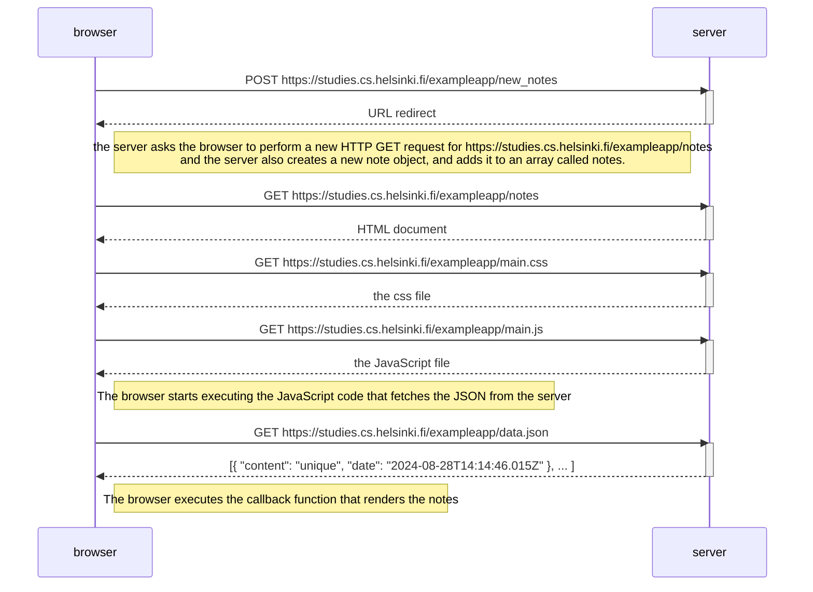

```mermaid
sequenceDiagram
    participant browser
    participant server

    browser->>server: POST https://studies.cs.helsinki.fi/exampleapp/new_notes
    activate server
    server-->>browser: URL redirect
    deactivate server

    Note right of browser: the server asks the browser to perform a new HTTP GET request for https://studies.cs.helsinki.fi/exampleapp/notes<br> and the server also creates a new note object, and adds it to an array called notes.

    browser->>server: GET https://studies.cs.helsinki.fi/exampleapp/notes
    activate server
    server-->>browser: HTML document
    deactivate server

    browser->>server: GET https://studies.cs.helsinki.fi/exampleapp/main.css
    activate server
    server-->>browser: the css file
    deactivate server

    browser->>server: GET https://studies.cs.helsinki.fi/exampleapp/main.js
    activate server
    server-->>browser: the JavaScript file
    deactivate server

    Note right of browser: The browser starts executing the JavaScript code that fetches the JSON from the server

    browser->>server: GET https://studies.cs.helsinki.fi/exampleapp/data.json
    activate server
    server-->>browser: [{ "content": "unique", "date": "2024-08-28T14:14:46.015Z" }, ... ]
    deactivate server

    Note right of browser: The browser executes the callback function that renders the notes
```